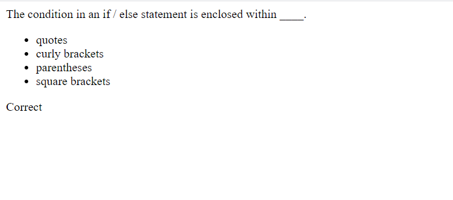

# timed-coding-quiz

url: https://zacktmiller92.github.io/timed-coding-quiz/

## Overview
This project is to practice manipulation of the DOM. 
- A button exists to start the quiz
- When the button is clicked, the quiz starts and the first question appears
- As questions are answered correctly, points are added to the user's score
- When there are no more questions, the quiz ends and the user's score is displayed

